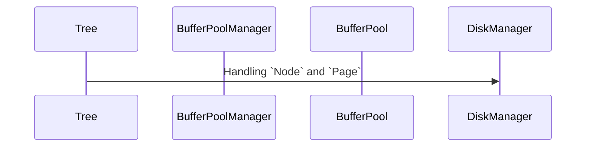
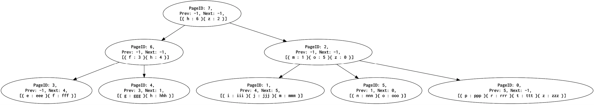

# B+Tree implementation in Go

[](https://github.com/naoto0822/go-b-plus-tree/actions/workflows/ci.yml)
[](https://goreportcard.com/report/github.com/naoto0822/go-b-plus-tree)
[](https://github.com/naoto0822/go-b-plus-tree/blob/main/LICENSE)

## Overview

> TODO

## Feature

- [x] Get
- [x] Insert
- [x] RangeScan (ASC)
- [ ] Delete
- [x] Split Node
- [ ] Merge Node

## Design

### Layer

- `Tree`
- `BufferPoolManager`
- `BufferPool`
- `DiskManager`



### Tree / Node

- InternalNode
	- Key and PageID
- LeafNode
	- Key and Value
	- Connected horizontal nodes



### Page Layout

Using `gob` for serialization and deserialization.

```go
type Page struct {
	ID       int64
	NodeType NodeType
	PrevID   int64
	NextID   int64
	Records  []KeyValue
}
```

## Usage

```go
path := "./test.btr"
disk, err := bplustree.NewDiskManager(path)
if err != nil {
	panic(err)
}
defer disk.Close()

bufferPoolManager := bplustree.NewBufferPoolManager(disk)
tree := bplustree.NewTree(bufferPoolManager)

// Get
got, err := tree.Get([]byte(`m`))
if err != nil {
	fmt.Printf("error: %+v\n", err)
} else {
	fmt.Printf("got: key: %v, value: %v\n", string(got.Key), string(got.Value))
}

// Insert
err := tree.Insert([]byte(`o`), []byte(`ooo`))
if err != nil {
	fmt.Printf("error: %+v\n", err)
}

// RangeScan
start := []byte(`h`)
end := []byte(`o`)
got, err := tree.RangeScan(start, end)
if err != nil {
	fmt.Printf("error: %+v\n", err)
} else {
	outFmt := ""
	for _, kv := range got {
		outFmt += fmt.Sprintf(" {%s: %s} ", string(kv.Key), string(kv.Value))
	}
	fmt.Printf("got startKey: %v, endKey: %v \n records: %v \n", string(start), string(end), outFmt)
}
```

## TODO

### Slotted Page Layout

- [CMU Database Systems - 03 Database Storage I (Fall 2018)](https://www.youtube.com/watch?v=uuX4PQXBeos)
- [CMU Database Systems - 04 Database Storage II (Fall 2018)](https://www.youtube.com/watch?v=NXRgIsH83xE)

### Clock-Sweep

- [CS 537 Notes, Section #20: Clock Algorithm, Thrashing](https://pages.cs.wisc.edu/~bart/537/lecturenotes/s20.html)

### Memcomparable Format

- [MyRocks record format](https://github.com/facebook/mysql-5.6/wiki/MyRocks-record-format)
- [pingcap/tidb bytes.go](https://github.com/pingcap/tidb/blob/master/util/codec/bytes.go)

### etc

- [ ] arrange `Tree` reciever name
- [ ] update error message
- [ ] fix error handling
- [ ] delete `NodeTypeRoot`
- [ ] more test code

## Test

```
$ make test
```

## Reference

- [riywo/b-plus-tree](https://github.com/riywo/b-plus-tree)
- [KOBA789/relly](https://github.com/KOBA789/relly)
- [totechite/b_plus_tree](https://github.com/totechite/b_plus_tree)

## License

MIT
